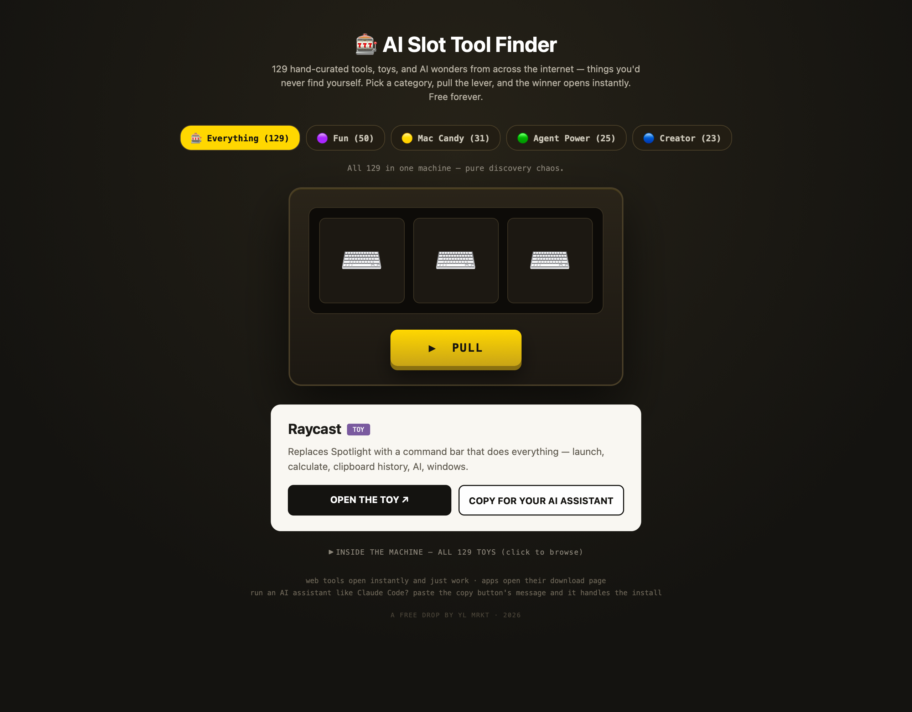

# 🎰 AI Slot Tool Finder

**Pull the lever. Discover a tool you'd never find yourself.**

A slot machine loaded with **157 hand-curated tools, toys, and AI wonders** from across the internet — live-radio globes, browser flight simulators, AI that writes cited research papers, free Photoshop clones, menu-bar magic for your Mac. Pick a category, pull, and the winner opens instantly.

No signups. No tracking. No ads. Free forever.

## 🕹️ Try it now

**[▶ PLAY IT HERE](https://cuttingthru18-cmd.github.io/ai-slot-tool-finder/)** — works in any browser, any device.

Or run it locally: download `index.html`, double-click it. That's the whole install.

## 🎡 What's inside

| Category | Count | What it means |
|---|---|---|
| 🟣 **Fun** | 50 | Pure toys — websites that exist only to amaze: globes, games, art, sound. Zero productivity, maximum wonder. |
| 🟡 **Mac Candy** | 31 | Free apps that make your Mac prettier or smoother — menu bar magic, window tricks, interface glow-ups. |
| 🟢 **Agent Power** | 25 | AI tools and playgrounds — things that build, write, research, or act on their own. The future, try-able today. |
| 🔵 **Creator** | 23 | Weapons for content makers — editors, converters, audio fixers, screenshot beautifiers. |
| 🪟 **Windows Candy** | 28 | Free apps that glow up a Windows PC — PowerToys, living wallpapers, the other candy store. |

Every entry passed the same quality gate: **free (or a real free tier), alive, safe, and genuinely "whoa."** The machine deals with no repeats — you'll see all 157 before you see one twice. Prefer browsing to gambling? Click *"INSIDE THE MACHINE"* at the bottom for the full list.

## 🤖 The AI assistant button

Run an AI assistant like [Claude Code](https://claude.com/claude-code)? When the machine picks an installable tool, hit **COPY FOR YOUR AI ASSISTANT** and paste the message — your assistant vets and installs it for you. No assistant? The tool's page opens either way; install it the normal way.

## 📌 Make it feel like an app

- **Mac (Safari):** open the page → File → **Add to Dock**. Icon in your Dock, its own window.
- **iPhone/iPad:** Share → **Add to Home Screen**.

## 🛠️ How it was made

Curated and built by an AI assistant (Claude Code) directed by a human with taste — the tool list was harvested by research agents from sources like [awesome-mac](https://github.com/jaywcjlove/awesome-mac), [tools.simonwillison.net](https://tools.simonwillison.net), [neal.fun](https://neal.fun), the [Charm](https://github.com/charmbracelet) suite, and dozens of indie builders' portfolios, then quality-gated by hand. One HTML file, zero dependencies.

Found a dead link, or know a tool that clears the "whoa" bar? Open an issue or PR — the machine grows.

## 📄 License

MIT — do whatever you want with it. The tools inside belong to their own brilliant creators; this machine just introduces you.

---

*First free product shipped by YL MRKT. 🎰 Good luck at the reels.*
